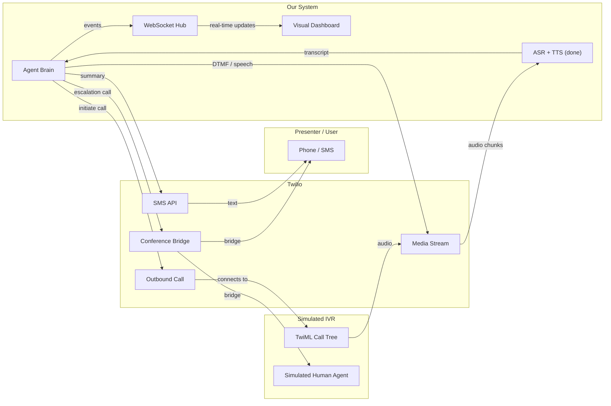

# LLM Call Center Agent

Python call-center agent with a local CLI, a FastAPI server, and Boson-compatible voice event handling. The project uses Eigen AI for chat, ASR, and optional TTS.

## Current State

The repo is currently inbound-first: it can run text and audio conversations, expose workflow APIs, and handle Boson-style voice events. The next milestone is an **Outbound Voice Agent MVP Demo** that turns the system into a proxy agent that calls a simulated IVR via Twilio, navigates the call tree autonomously, escalates to a presenter when blocked, and shows live progress on a dashboard.

Current capabilities:

- Runs text conversations from the terminal
- Accepts audio files, transcribes them with Eigen ASR, and continues the dialogue in the CLI
- Exposes an HTTP API for workflow routing, field capture, action dispatch, and document submission
- Accepts Boson-style voice events on `/voice-event`
- Supports seeded demo scenarios on `/demo/scenarios`, `/demo/start`, `/demo/turn`, and `/demo/voice-turn`

Supported workflows:

- `password_reset`
- `billing_dispute`
- `order_status`
- `update_profile`
- `cancel_service`

## Outbound Voice Agent MVP Demo

### Goal

Transform the codebase from an inbound call-center agent into an outbound proxy agent that:

1. Calls a simulated IVR through Twilio
2. Navigates the call tree autonomously
3. Escalates to a presenter when it gets stuck
4. Displays real-time progress on a visual dashboard

### What Already Landed

These pieces are already on `main` and should be treated as complete:

- **TTS integration**: [`audio/tts.py`](audio/tts.py) has `synthesize_speech()`, `realize_spoken_text()`, SSML generation, and voice response envelopes. `higgs2p5` is already wired in config.
- **Eigen client generics**: [`client/eigen.py`](client/eigen.py) has `generate_file()` and `generate_form()` using `httpx` for multipart-style service calls.
- **ASR rework**: [`asr/transcribe.py`](asr/transcribe.py) has `transcribe_bytes()` for in-memory audio and robust response parsing.
- **Demo scenarios**: [`demo/scenarios.py`](demo/scenarios.py) defines `password_reset` and `cancel_service` with opening messages and seed scripts.
- **Demo API surface**: [`api/app.py`](api/app.py) already exposes `GET /demo/scenarios`, `POST /demo/start`, `POST /demo/turn`, and `POST /demo/voice-turn`.
- **Orchestrator demo methods**: `start_demo_session()`, `handle_demo_turn()`, and `handle_demo_voice_turn()` already exist.
- **Voice response contracts**: [`contracts/api.py`](contracts/api.py) already contains `VoiceResponseEnvelope` and `BosonAssistantOutput`.
- **Session TTL**: In-memory and SQLite session stores already support expiry via `SESSION_TTL_SECONDS` and `cleanup_expired()`.
- **Config support**: `HIGGS_TTS_MODEL`, `DEMO_BRAND_NAME`, `DEMO_TTS_VOICE`, `EIGEN_GENERATE_URL`, and `ASR_LANGUAGE` are already environment-configurable.

### Architecture Overview



### Delivery Tracker

| ID | Workstream | Status | Planned Files |
| --- | --- | --- | --- |
| `twilio-setup` | Set up Twilio account, get 2 phone numbers, add credentials to `.env` | Pending | `.env`, Twilio console |
| `calltree-schema` | Design call tree JSON schema and create `acme_corp.json` with all 5 workflow paths | Pending | `calltree/` |
| `ivr-simulator` | Build TwiML-based simulated IVR with menu nodes and simulated human agents | Pending | `telephony/ivr_simulator.py` |
| `twilio-client` | Build Twilio REST wrapper for outbound calls, DTMF, SMS, and conferencing | Pending | `telephony/twilio_client.py` |
| `media-stream` | Build Twilio Media Stream WebSocket handler for bidirectional audio | Pending | `telephony/media_stream.py` |
| `mulaw-asr` | Add mu-law to WAV conversion and `transcribe_mulaw_chunk()` for Twilio audio | Pending | `asr/transcribe.py` |
| `agent-navigator` | Build the agent brain for prompt classification, navigation, and state tracking | Pending | `calltree/navigator.py` |
| `ivr-prompts` | Add IVR classification prompt contracts | Pending | `contracts/prompts.py` |
| `dashboard-backend` | Build WebSocket event hub and dashboard routes | Pending | `dashboard/ws.py`, `api/app.py` |
| `dashboard-frontend` | Build visual dashboard with call tree graph, transcript panel, and status indicators | Pending | `dashboard/static/` |
| `escalation-flow` | Implement escalation: call and text presenter, then patch through with conference bridge | Pending | `telephony/twilio_client.py` and orchestrator wiring |
| `completion-flow` | Implement completion: call presenter with summary, send SMS, generate transcript link | Pending | orchestrator and Twilio integration |
| `demo-entrypoint` | Add `--demo` flag to launch API server, agent, and dashboard together | Pending | `main.py` |

### Phase 1: Twilio, Call Tree Schema, and Simulated IVR

#### 1. Twilio account setup

This is a manual setup step outside the repo:

- Create a Twilio account
- Provision two phone numbers
- Use **Number A** as the simulated Acme Corp IVR
- Use **Number B** as the agent phone for outbound calls and escalation
- Configure Number A's voice webhook to point at the IVR routes in this service

Add these values to `.env`:

```env
TWILIO_ACCOUNT_SID=your-account-sid
TWILIO_AUTH_TOKEN=your-auth-token
TWILIO_IVR_NUMBER=+15555550101
TWILIO_AGENT_NUMBER=+15555550102
PRESENTER_PHONE_NUMBER=+15555550103
```

#### 2. Call tree schema

Planned file: `calltree/schemas/acme_corp.json`

Each node should be a small, explicit contract. Example:

```json
{
  "id": "root",
  "prompt": "Thank you for calling Acme Corp. Press 1 for billing, 2 for account services, 3 for order status.",
  "input_type": "dtmf",
  "transitions": {
    "1": "billing_menu",
    "2": "account_menu",
    "3": "order_menu"
  }
}
```

Leaf nodes should connect to simulated human agents and cover all five supported workflows.

#### 3. Simulated IVR

Planned file: `telephony/ivr_simulator.py`

Scope:

- FastAPI routes that return TwiML
- `<Say>` and `<Gather>` menus for IVR navigation
- Leaf-node transfers to simulated human agents
- Reuse the existing TTS helpers from [`audio/tts.py`](audio/tts.py) where voice output is needed

### Phase 2: Agent Brain and Twilio Media Streams

#### 1. Twilio client wrapper

Planned file: `telephony/twilio_client.py`

Scope:

- Initiate outbound calls
- Attach `<Stream>` for bidirectional audio
- Send DTMF digits to active calls
- Create and manage conference calls
- Send SMS updates

#### 2. Media Stream handler

Planned file: `telephony/media_stream.py`

Scope:

- FastAPI WebSocket endpoint for Twilio Media Streams
- Receive mu-law audio packets
- Convert audio to WAV and buffer intelligently
- Detect pauses and send chunks to ASR
- Send TTS audio back to Twilio
- Emit transcript events to the navigator

#### 3. Mu-law ASR adapter

Extend [`asr/transcribe.py`](asr/transcribe.py) with:

- `transcribe_mulaw_chunk(mulaw_bytes, sample_rate=8000)`

That function should:

1. Convert Twilio-native mu-law bytes to WAV
2. Call the existing `transcribe_bytes()`
3. Return normalized transcript text

#### 4. Agent navigator

Planned file: `calltree/navigator.py`

Core loop:

1. **Listen**: receive what the IVR just said
2. **Classify**: determine whether the prompt is a menu, info request, confirmation, transfer, hold, error, or human agent
3. **Decide**: choose DTMF, spoken response, wait, or escalation
4. **Track**: update call-tree position and task progress
5. **Emit**: send dashboard events
6. **Repeat** until the task completes or escalation is required

Planned reuse points:

- `WorkflowSchema` for task knowledge
- [`dialogue/manager.py`](dialogue/manager.py) for field validation
- [`demo/scenarios.py`](demo/scenarios.py) for seeded task context

#### 5. IVR prompt contracts

Extend [`contracts/prompts.py`](contracts/prompts.py) with:

- `build_ivr_classification_prompt()`
- `IvrClassificationResponse`

The prompt contract should classify prompts into:

- `menu`
- `info_request`
- `confirmation`
- `transfer`
- `hold`
- `error`
- `human_agent`

### Phase 3: Visual Dashboard

#### 1. WebSocket event hub

Planned file: `dashboard/ws.py`

The navigator should publish events such as:

```json
{ "type": "node_entered", "node_id": "billing_menu", "label": "Billing Menu" }
{ "type": "transcript", "role": "ivr", "text": "Please enter your account number." }
{ "type": "transcript", "role": "agent", "text": "12345678" }
{ "type": "escalation", "reason": "missing_info", "field": "verification_code" }
{ "type": "completed", "summary": "Password reset completed." }
```

#### 2. Dashboard frontend

Planned files:

- `dashboard/static/index.html`
- `dashboard/static/app.js`

UI goals:

- `vis.js` graph rendering with zero build step
- Call-tree nodes colored by state: pending, active, completed, escalated
- Live transcript panel
- Red escalation banner when the presenter is needed
- Green completion banner with summary and transcript link

#### 3. Dashboard routes

Extend [`api/app.py`](api/app.py) with:

- `GET /dashboard`
- `WS /dashboard/ws`
- `GET /transcript/{session_id}`

### Phase 4: Escalation, Bridging, and Completion

#### 1. Escalation flow

When the agent is stuck:

1. Call the presenter through Twilio
2. Speak the current status through TTS
3. Send an SMS summary
4. Update the dashboard to show escalation state

#### 2. Bridge flow

When the presenter needs to talk directly to the IVR's human agent:

1. Create a Twilio Conference
2. Add the IVR call leg
3. Add the presenter leg
4. Let the agent drop out or remain silent
5. Mark the dashboard as `BRIDGE ACTIVE`

#### 3. Completion flow

When the task completes:

1. Call the presenter with a spoken completion summary
2. Send an SMS summary
3. Show a green completion state on the dashboard
4. Expose a transcript at `GET /transcript/{session_id}`

### Planned File Map

New files:

- `calltree/__init__.py`
- `calltree/schemas/acme_corp.json`
- `calltree/registry.py`
- `calltree/navigator.py`
- `telephony/__init__.py`
- `telephony/twilio_client.py`
- `telephony/media_stream.py`
- `telephony/ivr_simulator.py`
- `dashboard/__init__.py`
- `dashboard/ws.py`
- `dashboard/static/index.html`
- `dashboard/static/app.js`

Modified files:

- `api/app.py`
- `asr/transcribe.py`
- `contracts/prompts.py`
- `config/models.py`
- `.env` and `.env.example`
- `requirements.txt`
- `main.py`

Already done:

- `audio/tts.py`
- `client/eigen.py`
- `demo/scenarios.py`
- `contracts/api.py`

## Requirements

- Python 3.10+
- An Eigen AI API key
- Twilio credentials for the outbound demo work described above

## Environment Setup

Copy the example file and add your credentials:

```bash
cp .env.example .env
```

Core values:

```env
EIGEN_API_KEY=your-api-key-here
EIGEN_BASE_URL=https://api-web.eigenai.com/api/v1
```

Common optional values:

```env
EIGEN_GENERATE_URL=https://api-web.eigenai.com/api/v1/generate
HIGGS_ASR_MODEL=higgs_asr_3
HIGGS_CHAT_MODEL=gpt-oss-120b
HIGGS_TTS_MODEL=higgs2p5
ASR_LANGUAGE=English
SESSION_DB_PATH=call_center_sessions.sqlite3
DEMO_BRAND_NAME=Callit-Dev
DEMO_TTS_VOICE=Linda
```

Outbound demo values:

```env
TWILIO_ACCOUNT_SID=your-account-sid
TWILIO_AUTH_TOKEN=your-auth-token
TWILIO_IVR_NUMBER=+15555550101
TWILIO_AGENT_NUMBER=+15555550102
PRESENTER_PHONE_NUMBER=+15555550103
```

Notes:

- `EIGEN_API_KEY` is required for chat, ASR, document extraction, and TTS calls.
- `SESSION_DB_PATH` controls where the API server stores session state.
- `DEMO_TTS_VOICE` and `HIGGS_TTS_MODEL` matter if you use the TTS helpers in [`audio/tts.py`](audio/tts.py).
- The Twilio variables are required only for the outbound demo work; they are not needed for the current inbound CLI/API flows.

## Install Dependencies

```bash
python3 -m venv .venv
source .venv/bin/activate
pip install --upgrade pip
pip install -r requirements.txt
```

## Run the CLI

Text mode:

```bash
python main.py --text
```

`python main.py` also defaults to text mode when no audio file is provided.

Audio mode:

```bash
python main.py path/to/audio.wav
```

The CLI will:

1. Upload the audio file to Eigen ASR
2. Print the transcript
3. Continue the workflow in interactive voice-mode dialogue

## Run the API Server

Using the built-in entry point:

```bash
python main.py --api --reload
```

Or directly with Uvicorn:

```bash
uvicorn api.app:app --reload
```

By default the server starts on `http://127.0.0.1:8000` and exposes:

- `http://127.0.0.1:8000/docs`
- `http://127.0.0.1:8000/health`

To change the bind address and port:

```bash
python main.py --api --host 0.0.0.0 --port 8000
```

## Voice and Demo API Usage

Start the API server first, then send Boson-compatible events to `/voice-event`.

Basic transcript event:

```bash
curl -X POST http://127.0.0.1:8000/voice-event \
  -H "Content-Type: application/json" \
  -d '{
    "type": "transcript",
    "session_id": "voice-demo-1",
    "text": "I need to reset my password"
  }'
```

Follow up with DTMF input:

```bash
curl -X POST http://127.0.0.1:8000/voice-event \
  -H "Content-Type: application/json" \
  -d '{
    "type": "dtmf",
    "session_id": "voice-demo-1",
    "digits": "12345678"
  }'
```

Supported Boson-style event types:

- `transcript` or `user_transcript`
- `dtmf`
- `interrupt` or `barge_in`
- `assistant_output` or `tts`

The payload may use either `session_id` or `call_id`.

Voice responses include a `voice_response` envelope alongside the plain `message`. That envelope contains:

- `spoken_text`
- `ssml`
- A Boson-ready `assistant_output` payload

If you send base64 audio as `audio_data` on a transcript event, the API runs ASR before routing the utterance:

```bash
AUDIO_BASE64=$(base64 < path/to/audio.wav | tr -d '\n')

curl -X POST http://127.0.0.1:8000/voice-event \
  -H "Content-Type: application/json" \
  -d "{
    \"type\": \"transcript\",
    \"session_id\": \"voice-audio-1\",
    \"audio_data\": \"${AUDIO_BASE64}\"
  }"
```

### Seeded demo endpoints

List available scenarios:

```bash
curl http://127.0.0.1:8000/demo/scenarios
```

Start a seeded voice demo:

```bash
curl -X POST http://127.0.0.1:8000/demo/start \
  -H "Content-Type: application/json" \
  -d '{
    "scenario_id": "password_reset",
    "channel": "voice"
  }'
```

Drive the seeded scenario with recorded audio:

```bash
curl -X POST http://127.0.0.1:8000/demo/voice-turn \
  -H "Content-Type: application/json" \
  -d '{
    "session_id": "replace-with-session-id",
    "audio_base64": "replace-with-base64-audio",
    "filename": "recording.webm",
    "content_type": "audio/webm"
  }'
```

## Backend Action Contract

Teammates replacing stub actions in [`actions/backend.py`](actions/backend.py) should follow this drop-in contract:

```python
def action_name(fields: dict[str, str]) -> str:
    ...
```

Rules:

- `fields` is the normalized `session.validated_fields` mapping after workflow validation has already passed.
- The function must stay synchronous and accept exactly one positional `fields` argument.
- The return value must be a caller-safe plain string. It is shown directly in the CLI, API, and voice channel.
- For compatibility with the current demo and tests, successful actions should begin with a stable status phrase:
  - `Password reset initiated`
  - `Dispute case opened`
  - `Profile updated`
  - `Service cancelled`
- To signal failure, either raise an exception or return a string that starts with `Error:`.

Key input shapes:

- `reset_password(fields) -> str`
  Required keys: `account_id`, `verification_code`
  Optional key: `callback_number`
- `cancel_subscription(fields) -> str`
  Required keys: `account_number`, `cancellation_reason`, `confirm_cancel`
  `confirm_cancel` arrives normalized as `yes` or `no`

The source file also defines per-action `TypedDict` contracts for all backend actions so replacements can use the exact expected shape.

## Demo Walkthrough

### 1. Start the API and verify health

```bash
python main.py --api --reload
```

In a second terminal:

```bash
curl http://127.0.0.1:8000/health
```

Expected result:

- JSON response with `{"status":"ok"}`

### 2. Demo a password reset over the HTTP API

Route the intent:

```bash
curl -X POST http://127.0.0.1:8000/route-intent \
  -H "Content-Type: application/json" \
  -d '{
    "session_id": "demo-password-1",
    "utterance": "I need to reset my password"
  }'
```

Submit the required fields:

```bash
curl -X POST http://127.0.0.1:8000/submit-field \
  -H "Content-Type: application/json" \
  -d '{
    "session_id": "demo-password-1",
    "field_name": "account_id",
    "value": "12345678"
  }'

curl -X POST http://127.0.0.1:8000/submit-field \
  -H "Content-Type: application/json" \
  -d '{
    "session_id": "demo-password-1",
    "field_name": "verification_code",
    "value": "654321"
  }'
```

Dispatch the backend action:

```bash
curl -X POST http://127.0.0.1:8000/dispatch-action \
  -H "Content-Type: application/json" \
  -d '{
    "session_id": "demo-password-1"
  }'
```

Expected result:

- `status` is `completed`
- `result` begins with `Password reset initiated`

### 3. Demo a billing dispute over the HTTP API

```bash
curl -X POST http://127.0.0.1:8000/route-intent \
  -H "Content-Type: application/json" \
  -d '{
    "session_id": "demo-dispute-1",
    "utterance": "I want to dispute a charge on my account"
  }'

curl -X POST http://127.0.0.1:8000/submit-field \
  -H "Content-Type: application/json" \
  -d '{
    "session_id": "demo-dispute-1",
    "field_name": "account_number",
    "value": "12345678"
  }'

curl -X POST http://127.0.0.1:8000/submit-field \
  -H "Content-Type: application/json" \
  -d '{
    "session_id": "demo-dispute-1",
    "field_name": "charge_date",
    "value": "03/01/2026"
  }'

curl -X POST http://127.0.0.1:8000/submit-field \
  -H "Content-Type: application/json" \
  -d '{
    "session_id": "demo-dispute-1",
    "field_name": "charge_amount",
    "value": "$95.00"
  }'

curl -X POST http://127.0.0.1:8000/submit-field \
  -H "Content-Type: application/json" \
  -d '{
    "session_id": "demo-dispute-1",
    "field_name": "dispute_reason",
    "value": "duplicate charge"
  }'

curl -X POST http://127.0.0.1:8000/dispatch-action \
  -H "Content-Type: application/json" \
  -d '{
    "session_id": "demo-dispute-1"
  }'
```

Expected result:

- `status` is `completed`
- `result` begins with `Dispute case opened`
- The response includes a deterministic `Case ID`

### 4. Demo the voice event path on `/voice-event`

Send a transcript event:

```bash
curl -X POST http://127.0.0.1:8000/voice-event \
  -H "Content-Type: application/json" \
  -d '{
    "type": "transcript",
    "session_id": "voice-demo-2",
    "text": "I need to reset my password"
  }'
```

Follow with DTMF input:

```bash
curl -X POST http://127.0.0.1:8000/voice-event \
  -H "Content-Type: application/json" \
  -d '{
    "type": "dtmf",
    "session_id": "voice-demo-2",
    "digits": "12345678"
  }'
```

Expected result:

- Responses include both `message` and `voice_response`
- `voice_response` contains `spoken_text`, `ssml`, and a Boson-ready `assistant_output` payload

### 5. Demo escalation and human handoff

Start a voice interaction, then ask for a human:

```bash
curl -X POST http://127.0.0.1:8000/voice-event \
  -H "Content-Type: application/json" \
  -d '{
    "type": "transcript",
    "session_id": "voice-escalation-1",
    "text": "I need to reset my password"
  }'

curl -X POST http://127.0.0.1:8000/voice-event \
  -H "Content-Type: application/json" \
  -d '{
    "type": "transcript",
    "session_id": "voice-escalation-1",
    "text": "let me speak to a human"
  }'
```

Expected result:

- `escalated` becomes `true`
- The returned `message` includes a human handoff summary

## Useful Files

- [`main.py`](main.py): CLI and API entry point
- [`api/app.py`](api/app.py): FastAPI routes and demo endpoints
- [`actions/backend.py`](actions/backend.py): backend action signatures, field shapes, and failure contract
- [`audio/tts.py`](audio/tts.py): TTS helpers and voice response shaping
- [`asr/transcribe.py`](asr/transcribe.py): ASR utilities
- [`config/models.py`](config/models.py): environment-backed settings
- [`contracts/api.py`](contracts/api.py): API and voice response models
- [`contracts/prompts.py`](contracts/prompts.py): prompt contracts
- [`demo/scenarios.py`](demo/scenarios.py): seeded demo scenarios
- [`boson/adapter.py`](boson/adapter.py): Boson event normalization
